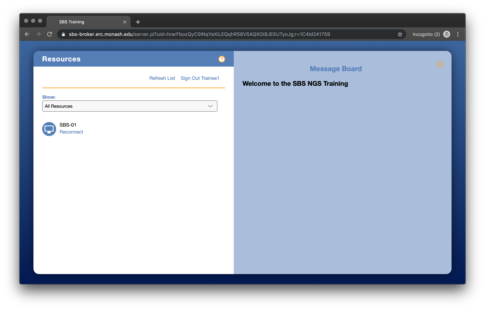
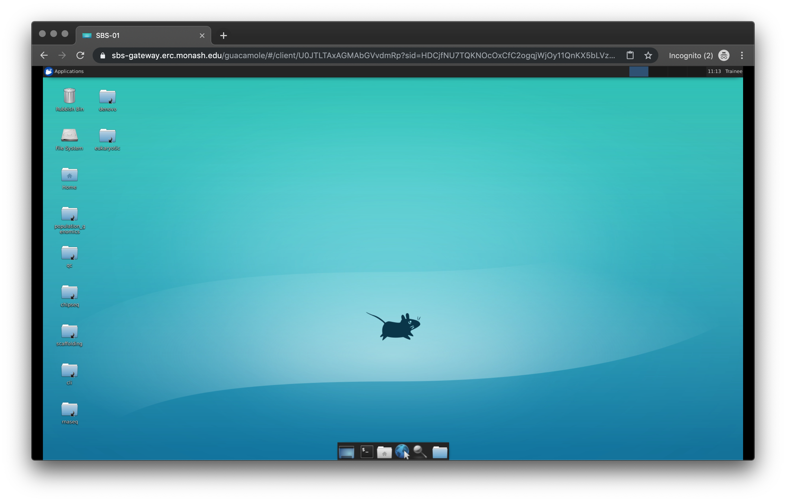
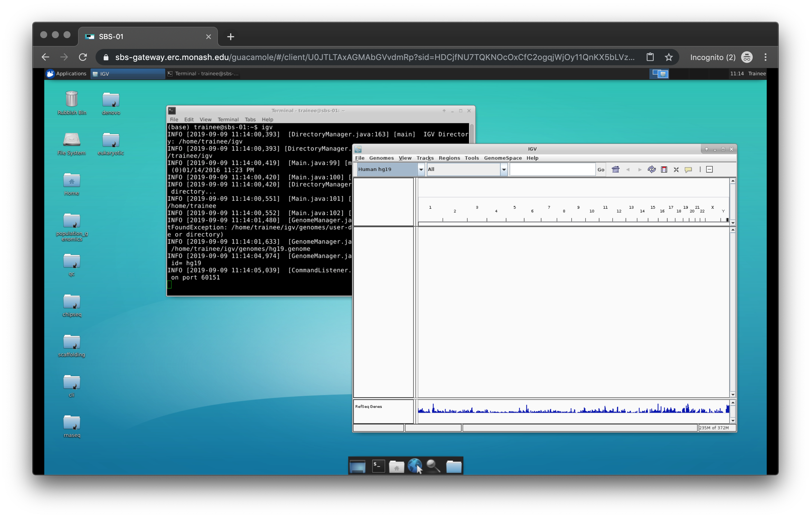
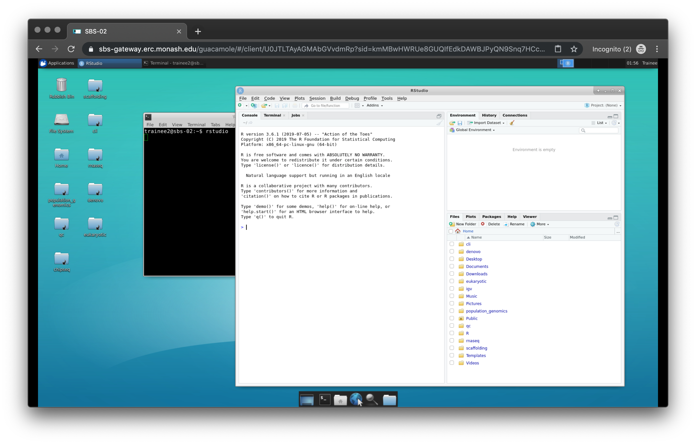

Accompanying material:
---------------------

* [Slides](./Topic 1.pdf)

How to login to training VM (please also see https://tsonika.github.io/NGS-SBS-Monash2019/login/login/)

The login URL/site is below: https://sbs-broker.erc.monash.edu/ 

Loading this URL in any browser will display the main/login page:
{:width="50%"}

Login using your assigned username and password, which we will provide

Upon login to the URL/site above, the assigned instance is shown:

{:width="50%"}

Click on the Reconnect link to then connect to the instance’s remote desktop (via HTML5 viewer). The instance’s desktop environment is then displayed:

{:width="50%"}

Training modules (e.g qc, cli) contain datasets required for each module. There is precomputed data for some of the section, please DO NOT DELETE.

Terminal/shell is available from the bottom tools bar:

{:width="70%"}

RStudio and firefox is also installed

{:width="70%"}

Acknowledgements
The training VMs have been kindly provided by the Monash eResearch platform at the Monash University. Mr Jerico Revote has provided his technical expertise in setting those up.

## Express Introduction to R

This quick introductory module introduces the basics of working with data using the R language. In this section we will cover variables, indexing, read in data, indexing dataframe.

We will use lesson material from the Carpentries:

https://datacarpentry.org/R-genomics/01-intro-to-R.html
