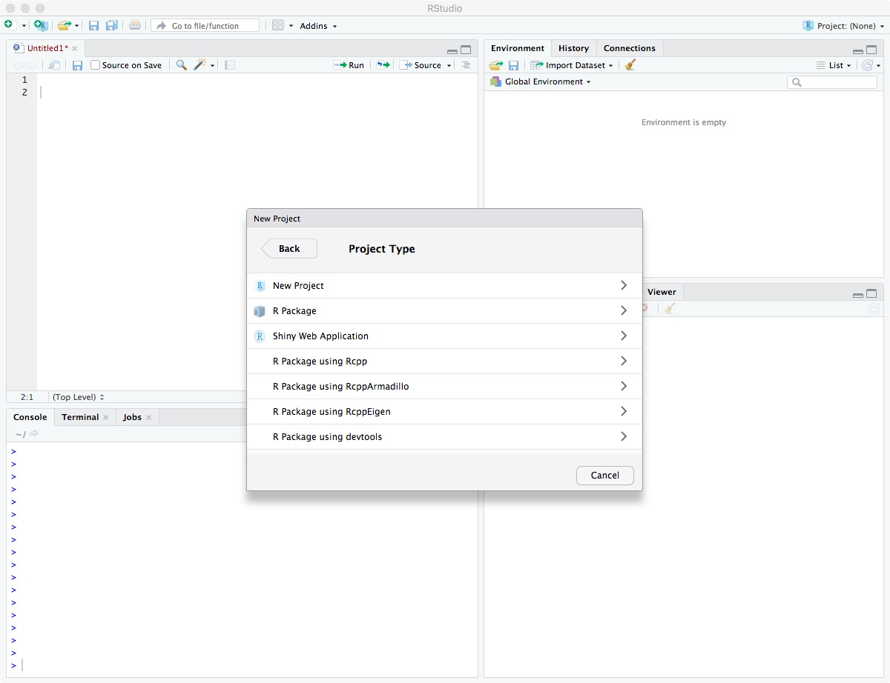
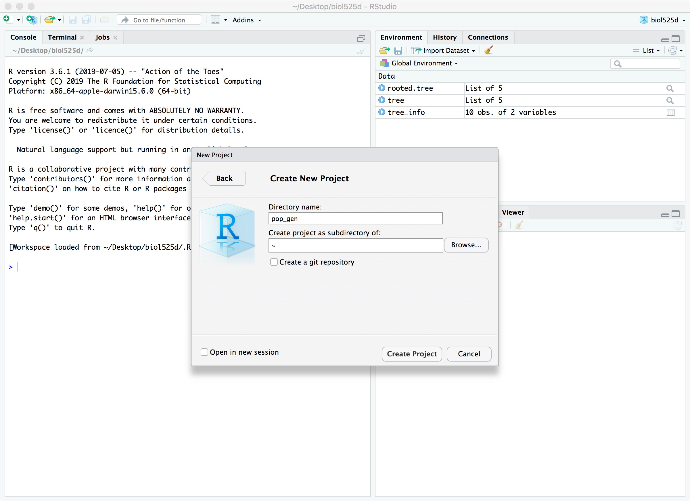
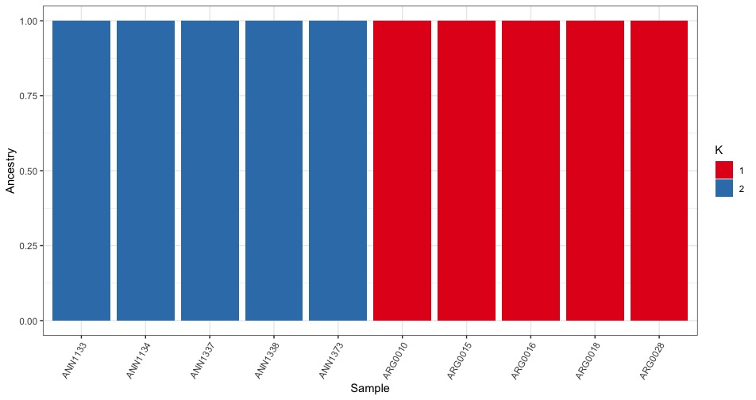

For the R portions of this, we're going to be using Rstudio. 


The first step to any organized R project is to create a new Rstudio project. A project keeps all your different scripts and results together in a single directory. It also separates saved variables, so when you are switching between different projects you aren't accidentally using the same variables between them. 

In Rstudio, select File->New Project

Then select "New Directory".


Click on "New Project".



Enter directory name "pop_gen" and put it somewhere you can get to. In my case, I put it on the ~ directory. Finally, click "Create Project".



After it has been created, move your "analysis" and "vcf" directory into your pop_gen project directory so you have easy access to those files.

```bash
cp -r ~/analysis ~/pop_gen/
cp -r ~/vcf ~/pop_gen/
```

You're now in your Rstudio Project and the next step is to install the tidyverse package, which includes a suite of tools for manipulating data and plotting. The examples today will be focused on tidyverse solutions to problems. One key feature of the tidyverse world is the use of "%>%" to pipe data between commands. This functions similar to "\|" in the commandline and helps put together strings of commands that are work together and are easy to understand. 


``` r
#Run all following commands in Rstudio
install.packages("tidyverse") 
library(tidyverse)
```

We calculated cluster assignment for each sample at different values of K. Lets try loading up a single output file.

``` r
samplelist <- read_tsv("analysis/samplelist.txt",
                       col_names = "sample")

read_delim("analysis/full_genome.filtered.numericChr.2.Q",
                  col_names = paste0("Q",seq(1:2)),
                  delim=" ")

# A tibble: 10 x 2
        Q1      Q2
     <dbl>   <dbl>
 1 0.00001 1.000  
 2 0.00001 1.000  
 3 0.00001 1.000  
 4 0.00001 1.000  
 5 0.00001 1.000  
 6 1.000   0.00001
 7 1.000   0.00001
 8 1.000   0.00001
 9 1.000   0.00001
10 1.000   0.00001

```
We're using the command _read\_delim_ which requires column names. Since the data file doesn't have any column names, we have to specify them and we're using a combination of paste and seq to produce "Q1", "Q2". We could have hard coded it c("Q1","Q2") but this way it works for an arbitrary number of columns just by changing the second value in seq(). 

Now we could work on each value of K individually, but its easier to load all of them at once. One problem is that they each have different numbers of columns. The solution is converting from a wide to long format. In a long format, each row has a single data point instead of multiple. The tidyverse tools are set up to prefer long data ((and there are other reasons)[https://sejdemyr.github.io/r-tutorials/basics/wide-and-long/#a-case-for-long-data]) so lets do that. 

Its possible to load multiple files in a single call, but for transparency lets use a loop. We first make an empty dataframe that we're going to fill, then we loop through our output files, convert them to long format and add them to the master set.

```r
all_data <- tibble(sample=character(),
                   k=numeric(),
                   Q=character(),
                   value=numeric())

for (k in 1:5){
  data <- read_delim(paste0("analysis/full_genome.filtered.numericChr.",k,".Q"),
                  col_names = paste0("Q",seq(1:k)),
                  delim=" ")
  data$sample <- samplelist$sample
  data$k <- k
  
  #This step converts from wide to long.
  data %>% gather(Q, value, -sample,-k) -> data
  all_data <- rbind(all_data,data)
}
all_data
# A tibble: 150 x 4
   sample      k Q     value
   <chr>   <int> <chr> <dbl>
 1 ANN1133     1 Q1        1
 2 ANN1134     1 Q1        1
 3 ANN1337     1 Q1        1
 4 ANN1338     1 Q1        1
 5 ANN1373     1 Q1        1
 6 ARG0010     1 Q1        1
 7 ARG0015     1 Q1        1
 8 ARG0016     1 Q1        1
 9 ARG0018     1 Q1        1
10 ARG0028     1 Q1        1
```

Now to plotting. We first try plotting just K=2 by filtering using the filter() command.
```r

all_data %>%
  filter(k == 2) %>%
  ggplot(.,aes(x=sample,y=value,fill=factor(Q))) + 
  geom_bar(stat="identity",position="stack")
```


Hurray, it works! Although the base plot is pretty ugly. Lets fix a few things:
* *xlab("Sample") + ylab("Ancestry")* <= Change the axis labels to be more accurate
* *theme_bw()* <= Remove the grey background.
* *theme(axis.text.x = element_text(angle = 60, hjust = 1))* <= Rotate the x-axis labels so they don't overlap
* *scale_fill_brewer(palette="Set1",labels=c("1","2"),name="K")* <= Change the fill color and legend labels

``` r
all_data %>%
  filter(k == 2) %>%
  ggplot(.,aes(x=sample,y=value,fill=factor(Q))) + 
  geom_bar(stat="identity",position="stack") +
  xlab("Sample") + ylab("Ancestry") +
  theme_bw() +
  theme(axis.text.x = element_text(angle = 60, hjust = 1)) +
  scale_fill_brewer(palette="Set1",name="K",
                    labels=c("1","2"))
```



We can also plot all the different K values together using facet_wrap(). 

``` r
all_data %>%
  ggplot(.,aes(x=sample,y=value,fill=factor(Q))) + 
  geom_bar(stat="identity",position="stack") +
  xlab("Sample") + ylab("Ancestry") +
  theme_bw() +
  theme(axis.text.x = element_text(angle = 60, hjust = 1)) +
  scale_fill_brewer(palette="Set1",name="K",
                    labels=seq(1:5)) +
  facet_wrap(~k,ncol=1)
```


Plotting challenge 1
--------------------

-Reorder the samples in the plot so that the ARG samples are before the ANN samples. 

HINT:
  * Try the forcats package
  {: .spoiler}
  

Now lets move onto [Principal Component Analysis](./pca.md)
